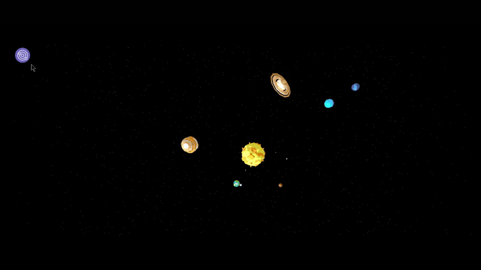

<div align = "center">
    <h1>A Solar System Online </h1>
    
</div>
<hr>
<h2>The idea of this project is to recreate our solar system in a simple way, but with the highest possible accuracy.You can view and interact with the project:<a href="https://sistema-solar-low-poly.vercel.app/">
  
</a></h2>


<p>The project includes</p>

<ul>
  <li>Information about the planet</li>
  <li>Orbits</li>
  <li>Dynamic lighting </li>
  <li>Orbital rotation speed</li>
  <li>Different camera angles</li>
  <li>Menu creation and hiding<</li>
</ul>

<div align="center">
  <h2>Simulation Demo</h2>
  <p>Planets orbit and rotate dynamically.</p>
  

  <h2>Menu Interaction Demo</h2>
  <p>Click on a planet name to navigate directly to it.</p>
  
</div>


<h2>
<h1>How to run </h1>


```bash
# Clone the repository
git clone https://github.com/username/solar-system.git

# Navigate into the project folder
cd solar-system

# Install all dependencies listed in package.json
npm install

# Install Three.js if not already included
npm install three

# Start the Vite development server
npx vite
```
<hr>

  <h2>Technologies Used</h2>
<div align="center">

  <!-- Space / NASA Theme -->
  <a href="https://en.wikipedia.org/wiki/Outer_space">
    
  </a>


  <!-- Core Web Technologies -->
  <a href="https://developer.mozilla.org/en-US/docs/Web/JavaScript">
    
  </a>
  <a href="https://developer.mozilla.org/en-US/docs/Web/HTML">
    
  </a>
  <a href="https://developer.mozilla.org/en-US/docs/Web/CSS">
    
  </a>
  <a href="https://nodejs.org/">
    
  </a>

  <!-- Tools / Libraries -->
  <a href="https://vitejs.dev/">
    
  </a>
  <a href="https://threejs.org/">
    
  </a>
</div>


 <h1>MIT License </h1>
<div align="center">
    
  <a href="https://opensource.org/licenses/MIT">
    
  </a>
</div>


