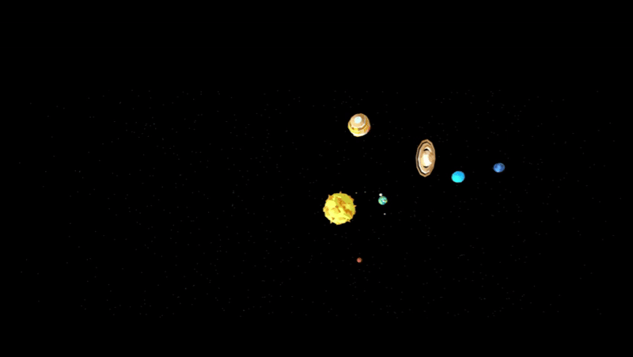

    <h1>A Solar System Online </h1>
    

<h2>The idea of this project is to recreate our solar system in a simple way, but with the highest possible <strong>accuracy</strong></h2>

The project includes

<ul>
  <li>Information about the planet</li>
  <li>Orbits</li>
  <li>Dynamic lighting </li>
  <li>Orbital rotation speed</li>
  <li>Different camera angles</li>
  <li>Menu creation and hiding<</li>
</ul>

    <h1>ASAS</h1>
  

